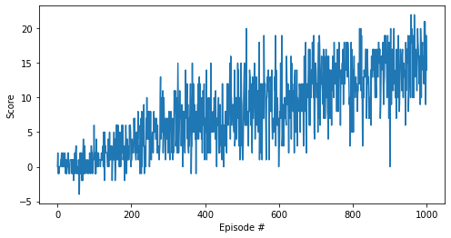
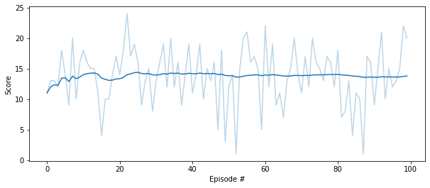

## Report

---

### Algorithm

To solve the problem, the Deep Q-Learning (DQN) algorithm was applied. The implementation is based on the Udacity [DQN project](https://github.com/udacity/deep-reinforcement-learning/tree/master/dqn), which has been adapted to the banana environment.

DQN represents a neural network that approximates an action-value function (`q` function) for a given state. The network has 2 hidden layers of 64 units each, ReLU activation and the following hyperparameters:

- buffer size: 1000000
- batch size: 64       
- discount factor (gamma): 0.999
- soft update factor (tau): 0.001          
- learning rate: 0.0005
- training steps: 20

### Training

The following diagram shows scores during training:

According to the diagram, the environment was solved after 900 episodes.

### Evaluation

The average score reaches almost 14 scores (over 100 consecutive episodes, after taking the maximum over both agents)

### Future Work

- Conv1d instead of linear layers and stacking previous states (history) may improve the agent.
- Importance sampling for replay buffer may also improve stability.